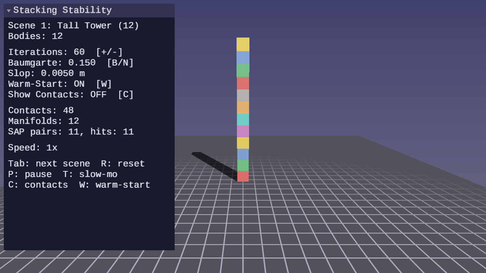
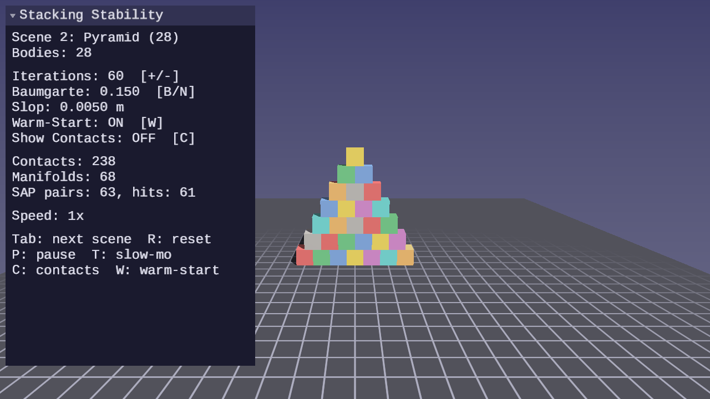
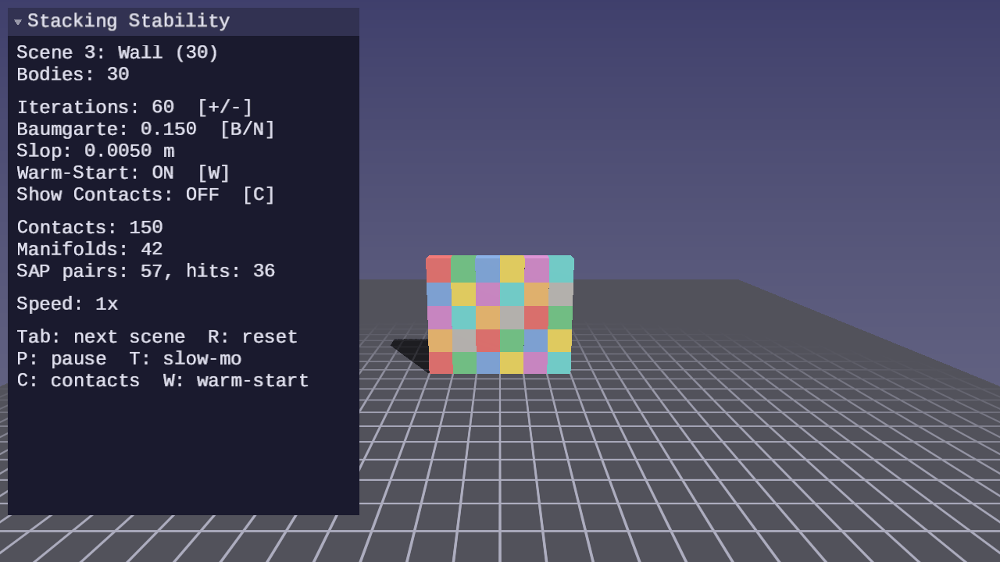
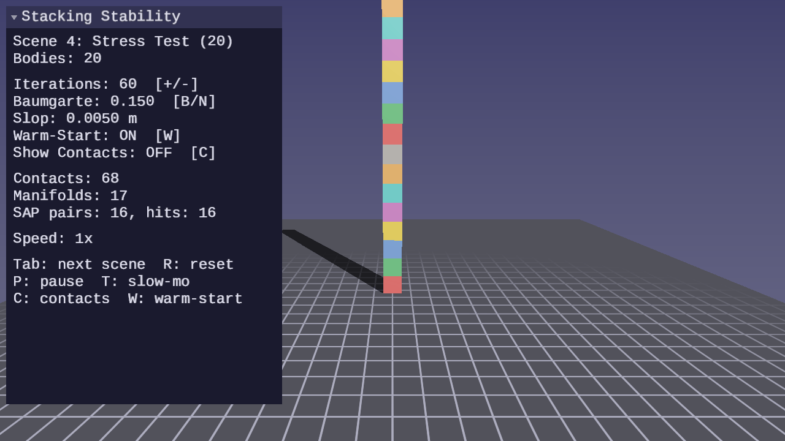
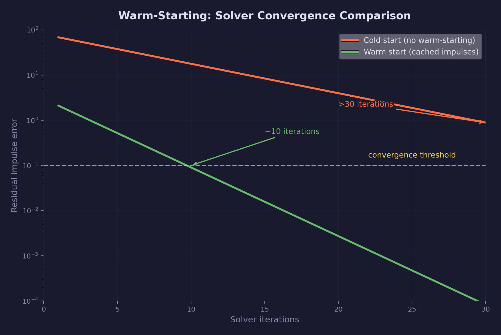
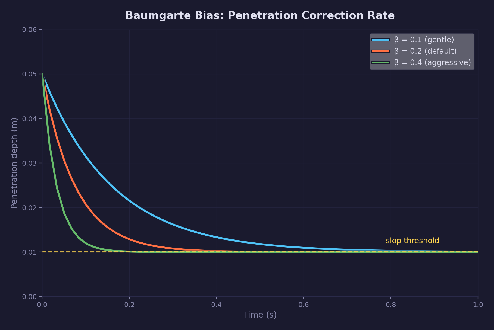

# Physics Lesson 14 — Stacking Stability

Tuning the sequential impulse solver for stable box stacking. Warm-starting,
Baumgarte stabilization, penetration slop, iteration counts, and position
correction turn the 5-box solver from Lesson 12 into one that handles 10+
boxes without collapse.

## What you will learn

- **Warm-starting** — why caching impulses across frames is the single most
  important technique for stacking stability, and how it reduces the iteration
  count needed for convergence
- **Baumgarte stabilization** — the velocity bias formula that corrects
  penetration without position-level projection, and how to tune it
- **Penetration slop** — a tolerance threshold that prevents jitter from
  micro-corrections on resting contacts
- **Solver iterations** — the relationship between iteration count, warm-start
  quality, and stack height, including diminishing returns
- **Position correction** — a post-solve pass that pushes penetrating bodies
  apart, using a correction fraction to avoid over-correction
- **ForgePhysicsSolverConfig** — a configuration struct that groups all tuning
  parameters in one place

## Result


### Scene animations

| Tall Tower (12) | Pyramid (28) |
|---|---|
|  |  |

| Wall (30) | Stress Test (15) |
|---|---|
|  |  |

The lesson presents stacking scenes with real-time UI controls for every
solver parameter. Boxes stack 15 high with the tuned solver (60 iterations,
β = 0.15, slop = 0.005). Disabling warm-starting or reducing iterations
causes the stack to collapse, making the effect of each parameter visible
immediately.

**Controls:**

| Key | Action |
|---|---|
| WASD / Mouse | Camera fly |
| P | Pause / resume |
| R | Reset simulation |
| T | Toggle slow motion |
| Tab | Cycle scenes |
| W | Toggle warm-starting (release mouse first) |
| + / - | Increase / decrease solver iterations |
| B / N | Increase / decrease Baumgarte factor |
| Escape | Release mouse / quit |

## The physics

### Why Lesson 12's solver struggles past 5 boxes

The sequential impulse solver from Lesson 12 converges correctly for short
stacks. Each iteration propagates constraint corrections one body at a time
from the ground upward. For a stack of $n$ boxes, the ground contact
correction must propagate through $n - 1$ intermediate bodies before reaching
the top. Each iteration advances the correction by one body, so the solver
needs roughly $n$ iterations just to propagate once — and multiple
propagation passes for convergence.

A 5-box stack converges in 20 iterations. An 8-box stack needs 40+. Beyond
that, the iteration budget becomes impractical. The solution is not more
iterations — it is starting closer to the answer.

### Warm-starting



Warm-starting applies the previous frame's converged impulses before the
first iteration. Because bodies in sustained contact change slowly between
frames, last frame's solution is a close approximation of this frame's
answer. The solver refines rather than rebuilds.

The cached impulse from the previous frame is applied to each body's
velocity at the start of the step:

$$
\Delta v = M^{-1} \cdot J^T \cdot \lambda_{cached}
$$

where $M^{-1}$ is the inverse mass matrix, $J^T$ is the transposed Jacobian,
and $\lambda_{cached}$ is the impulse stored from the previous frame.

Without warm-starting, the solver starts from zero each frame. With 10
iterations it barely stabilizes 5 boxes. With warm-starting, those same 10
iterations stabilize 10+ boxes — the first few iterations are small
refinements rather than full re-solves.

The convergence improvement is measurable: 10 iterations with warm-starting
produces results comparable to 50 iterations without it. This is the single
most important technique for stacking stability.

### Baumgarte stabilization



The impulse solver corrects velocities, not positions. Integration error
accumulates over time: bodies drift together by a small amount each step.
Baumgarte stabilization adds a velocity bias to the normal constraint that
pushes penetrating bodies apart:

$$
v_{bias} = \frac{\beta}{\Delta t} \cdot \max(d - s, 0)
$$

where $\beta$ is the Baumgarte factor (correction rate), $\Delta t$ is
the timestep, $d$ is the penetration depth (positive means overlap), and
$s$ is the penetration slop.

The factor $\beta$ controls how aggressively the solver corrects
penetration:

- **Too high** ($\beta > 0.3$) — the correction overshoots, causing jitter.
  Bodies vibrate as the solver alternates between over-correcting and
  pulling back.
- **Too low** ($\beta < 0.1$) — the correction is too slow. Bodies sink
  into each other over time, especially under heavy loads.
- **Stable range** ($\beta \in [0.1, 0.3]$) — the correction converges
  without oscillation. 0.2 is a practical default for box stacking.

### Penetration slop

Slop is a tolerance threshold below which no Baumgarte correction is
applied. Without it, the solver applies micro-corrections to contacts at
near-zero depth, causing visible jitter on resting surfaces.

The slop appears in the Baumgarte formula as the subtracted term $s$. When
$d \leq s$, the bias is zero — the solver treats the contact as resolved
and applies no correction. This creates a thin shell of allowed overlap
where bodies rest quietly.

Typical values are 0.005 m to 0.02 m (0.5 to 2 cm). Too large and bodies
visibly overlap. Too small and the jitter returns. 0.01 m is a practical
default.

### Solver iterations

Each solver iteration propagates constraint corrections one step through
the contact graph. For a stack of $n$ boxes, full propagation from ground
to top requires at least $n$ iterations. Multiple propagation passes are
needed for convergence — the first pass establishes approximate impulses,
subsequent passes refine them.

The relationship between iterations and stability:

- **5 iterations** — sufficient for 2-3 boxes with warm-starting
- **10 iterations** — stable for 5-8 boxes with warm-starting
- **20 iterations** — stable for 10+ boxes with warm-starting
- **30+ iterations** — diminishing returns; each additional iteration
  contributes less to convergence

Without warm-starting, these thresholds roughly double. The iteration
budget and warm-starting quality are the two dominant factors in stack
stability.

### Position correction

After the velocity solver finishes, a separate position correction pass
pushes penetrating bodies apart directly. This handles residual overlap
that the velocity solver could not fully resolve within its iteration
budget.

The solver computes a shared correction magnitude, then splits it between
the two bodies in proportion to inverse mass:

$$
\Delta x_i = \pm \frac{f \cdot m_i^{-1}}{\sum_j m_j^{-1}} \cdot \max(d - s, 0) \cdot \hat{n}
$$

where $f$ is the correction fraction (0.2 to 0.4), $m_i^{-1}$ is the
inverse mass of body $i$, $\sum_j m_j^{-1}$ is the sum of inverse masses
of both bodies, $d$ is penetration depth, $s$ is slop, and $\hat{n}$ is
the contact normal. Body A is displaced along $+\hat{n}$ and body B along
$-\hat{n}$, each by its share of the correction. Lighter bodies (higher
inverse mass) move more.

The correction fraction prevents over-correction. At $f = 1.0$, the full
overlap is removed in one step, which can launch resting bodies apart. At
$f = 0.2$, only 20% of the overlap is corrected per step, allowing the
velocity solver to handle the rest. Values in $[0.2, 0.4]$ balance
responsiveness with stability.

## The code

### Solver configuration

`ForgePhysicsSolverConfig` groups the Baumgarte and position correction
parameters. Iteration count and warm-start are passed directly to
`forge_physics_si_solve()`:

```c
ForgePhysicsSolverConfig cfg = forge_physics_solver_config_default();
cfg.baumgarte_factor    = 0.15f;  /* β: gentler bias for tall stacks      */
cfg.penetration_slop    = 0.005f; /* tighter overlap tolerance (m)         */
/* correction_fraction (0.4) and correction_slop (0.01) use defaults       */

int   iterations = 40;
bool  warm_start = true;
```

Each parameter is independently adjustable at runtime via the UI panel,
so the effect of each setting is visible immediately.

### Physics step

The solver pipeline follows the same structure as Lesson 12, with the
configuration struct controlling Baumgarte bias and position correction:

```c
/* Integrate velocities (gravity, damping) */
for (int i = 0; i < num_bodies; i++)
    forge_physics_rigid_body_integrate_velocities(&bodies[i], dt);

/* Detect contacts and build manifolds */
int manifold_count = detect_contacts(bodies, num_bodies, manifolds);

/* Solve velocity constraints (prepare + warm-start + iterate + store).
 * si_solve writes converged impulses back to the manifold array
 * internally, so no explicit store_impulses call is needed. */
forge_physics_si_solve(manifolds, manifold_count,
                       bodies, num_bodies,
                       iterations, dt, warm_start,
                       workspace, &cfg);

/* Push solved impulses into the persistent cache for warm-starting.
 * Use cache_store (not cache_update) — cache_update would overwrite
 * the solved impulses with scaled pre-solve values. */
for (int i = 0; i < manifold_count; i++)
    forge_physics_manifold_cache_store(&cache, &manifolds[i]);

/* Position correction: push penetrating bodies apart */
forge_physics_si_correct_positions(manifolds, manifold_count,
                                   bodies, num_bodies,
                                   cfg.correction_fraction,
                                   cfg.correction_slop);

/* Integrate positions */
for (int i = 0; i < num_bodies; i++)
    forge_physics_rigid_body_integrate_positions(&bodies[i], dt);
```

### Contact visualization

The lesson draws contact points, normals, and impulse magnitudes as
colored lines overlaid on the scene. Normal impulses are drawn along the
contact normal with length proportional to magnitude. Penetration depth
is color-coded: green for contacts within slop, yellow for mild overlap,
red for deep penetration.

This visualization makes solver behavior observable. When warm-starting
is disabled, the impulse lines flicker as the solver re-converges each
frame. When Baumgarte is too high, the contact colors oscillate between
green and red. Stable configurations show steady green contacts with
consistent impulse magnitudes.

## Key concepts

- **Warm-starting** — applying the previous frame's converged impulses
  before iterating, so the solver starts near the solution instead of
  from zero. The single most important technique for stacking stability.
- **Baumgarte stabilization** — a velocity bias proportional to
  penetration depth that corrects positional drift at the velocity level.
  Controlled by $\beta$ (correction rate) and slop (minimum threshold).
- **Penetration slop** — allowed overlap below which no correction is
  applied. Prevents jitter from micro-corrections on resting contacts.
- **Solver iterations** — more iterations improve convergence but with
  diminishing returns past ~30. Warm-starting reduces the iteration
  count needed by roughly half.
- **Position correction** — a post-velocity-solve pass that directly
  displaces penetrating bodies. Uses a correction fraction to avoid
  over-correction and instability.

## The physics library

This lesson adds the following to `common/physics/forge_physics.h`:

| Function / Type | Purpose |
|---|---|
| `ForgePhysicsSolverConfig` | Struct grouping Baumgarte bias and position correction parameters (`baumgarte_factor`, `penetration_slop`, `correction_fraction`, `correction_slop`) |
| `forge_physics_manifold_cache_store()` | Store solved impulses into the cache without the merge-scale that `cache_update` applies — required after `si_solve()` to preserve the solver's converged impulses for warm-starting |

The solver functions (`forge_physics_si_solve`,
`forge_physics_si_correct_positions`) were introduced in
[Lesson 12](../12-impulse-based-resolution/). This lesson demonstrates
how to tune them through the configuration struct rather than adding new
solver algorithms.

See: [common/physics/README.md](../../../common/physics/README.md)

## Where it is used

- [Physics Lesson 12 — Impulse-Based Resolution](../12-impulse-based-resolution/)
  provides the sequential impulse solver, accumulated clamping, and
  warm-starting infrastructure that this lesson tunes
- [Physics Lesson 13 — Constraint Solver](../13-constraint-solver/)
  uses the same Baumgarte stabilization and warm-starting for joint
  constraints
- [Physics Lesson 11 — Contact Manifold](../11-contact-manifold/)
  provides the manifold cache that stores impulses between frames,
  enabling warm-starting

## Building

```bash
cmake -B build
cmake --build build --config Debug

# Windows
build\lessons\physics\14-stacking-stability\Debug\14-stacking-stability.exe

# Linux / macOS
./build/lessons/physics/14-stacking-stability/14-stacking-stability
```

## Exercises

1. **Iteration sweep** — Record the maximum stable stack height for
   iteration counts 5, 10, 15, 20, 25, 30 with warm-starting enabled.
   Plot the results. Identify the point of diminishing returns for this
   scene's box size and mass.

2. **Warm-start comparison** — Disable warm-starting and find the
   iteration count needed to match the stability of 10 warm-started
   iterations. This quantifies the convergence benefit directly.

3. **Baumgarte sweep** — Fix iterations at 20 and sweep $\beta$ from
   0.05 to 0.5 in steps of 0.05. Record which values produce jitter,
   which produce sinking, and which are stable. Verify the $[0.1, 0.3]$
   stable range.

4. **Pyramid stacking** — Replace the vertical stack with a pyramid
   (4-3-2-1 arrangement). Pyramids are inherently more stable because
   each layer distributes load across multiple contacts. Compare the
   iteration count needed for a 10-layer pyramid vs. a 10-box tower.

5. **Split impulse** — Replace Baumgarte velocity bias with split
   impulse position correction: separate the penetration correction
   from the velocity solve entirely, applying position corrections
   directly to body positions via a pseudo-velocity pass. Compare
   energy behavior on bouncing objects — split impulse does not add
   energy the way Baumgarte can.

## Further reading

- Catto, "Iterative Dynamics with Temporal Coherence" (GDC 2005) — the
  source of the sequential impulse method, warm-starting, and Baumgarte
  stabilization; the primary reference for solver tuning
- Catto, "Modeling and Solving Constraints" (GDC 2009) — extends the
  method with position-level correction and discusses the trade-offs
  between Baumgarte and split impulse approaches
- Catto, "Understanding Constraints" (GDC 2014) — practical discussion
  of solver convergence, iteration counts, and warm-starting effectiveness
- Erin Catto, Box2D source code — canonical implementation of the tuned
  sequential impulse solver; `b2Island::Solve` demonstrates the complete
  warm-start → iterate → store → position-correct pipeline
- [Physics Lesson 12 — Impulse-Based Resolution](../12-impulse-based-resolution/)
- [Physics Lesson 13 — Constraint Solver](../13-constraint-solver/)
- [Physics Lesson 11 — Contact Manifold](../11-contact-manifold/)
- [Math Lesson 01 — Vectors](../../math/01-vectors/) — dot and cross
  products underlying Jacobian computation
- [Math Lesson 05 — Matrices](../../math/05-matrices/) — matrix
  multiplication and inversion, relevant to inverse mass matrices and
  effective mass
- [Math Lesson 08 — Orientation](../../math/08-orientation/) — quaternions
  and rotation matrices used for world-space inertia tensor transforms
