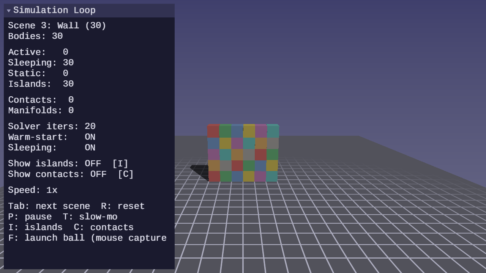
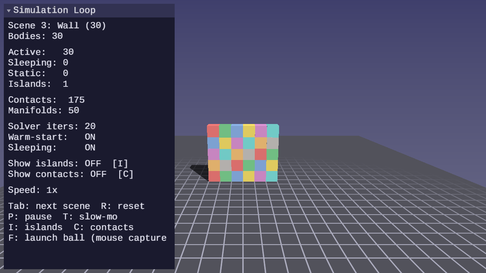
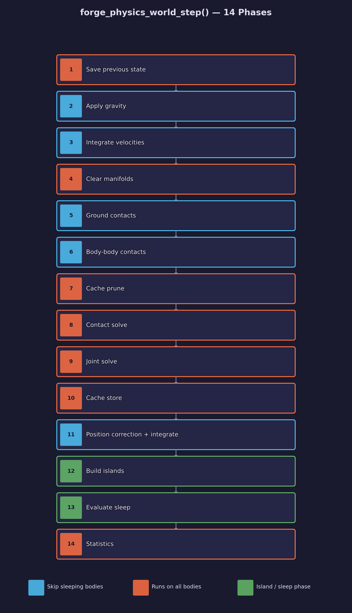
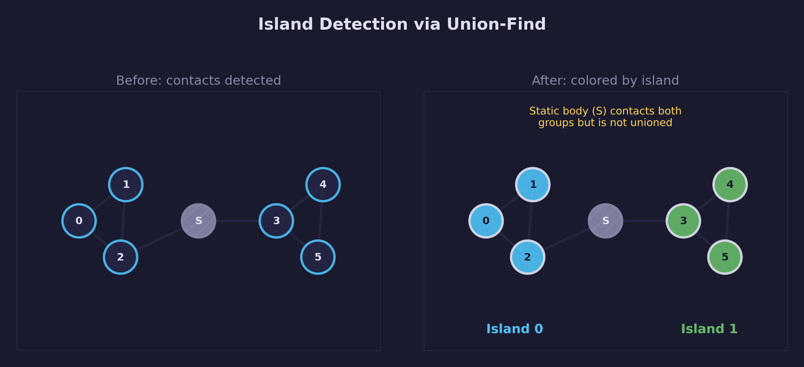
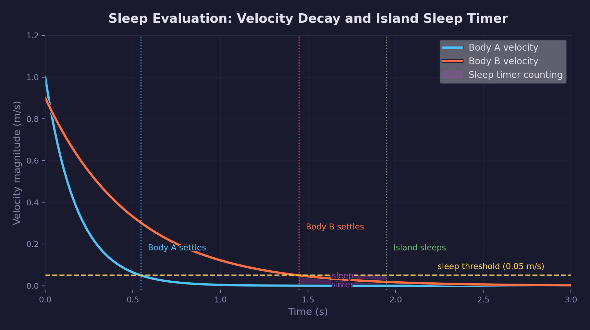

# Physics Lesson 15 — Simulation Loop

A unified world with one-call stepping, island detection, and body sleeping.

## What you will learn

- How to wrap the full simulation pipeline in a single `forge_physics_world_step()` call
- Island detection using union-find over the contact graph
- Body sleeping: velocity thresholds, per-island evaluation, and wake conditions
- Performance benefits: sleeping bodies skip gravity, integration, and constraint processing

## Result

| Screenshot | Animation |
|---|---|
|  |  |

The demo reuses the stacking scenes from Lesson 14 — tall tower, pyramid,
wall, and stress test — but drives them through the world API. Press **I** to
color bodies by island; press **F** to launch a ball. Sleeping bodies dim to
indicate that the solver is skipping them.

**Controls:**

| Key | Action |
|---|---|
| WASD / Mouse | Camera fly |
| P | Pause / resume |
| R | Reset simulation |
| T | Toggle slow motion |
| Tab | Cycle scenes |
| I | Toggle island coloring |
| C | Toggle contact visualization |
| F | Launch ball |
| Escape | Release mouse / quit |

## The physics

### The manual simulation loop (recap)

Lessons 01 through 14 each wrote their own simulation step. The structure was
always the same: accumulate gravity into the force cache, integrate velocities,
run broadphase and narrow-phase collision detection, solve contacts and joints,
correct positions, and clear the force cache. That loop appeared in every
`main.c` — roughly 100 lines per lesson, all slightly different, each one a
place where a parameter could be set wrong or a phase skipped by mistake.

That is a reasonable way to learn: writing every phase by hand makes each one
visible. But once all the pieces are understood, the manual loop becomes
friction. `ForgePhysicsWorld` removes it.

### ForgePhysicsWorld

`ForgePhysicsWorld` owns the full simulation state: body and shape arrays,
joint list, broadphase, solver workspace, manifold cache, and per-body
island and sleep state. All phases run inside `forge_physics_world_step()`.

The lifecycle is init, populate, step, destroy:

```c
ForgePhysicsWorld world;
forge_physics_world_init(&world, forge_physics_world_config_default());

/* Add a dynamic box at y=5 */
ForgePhysicsRigidBody box = forge_physics_rigid_body_create(
    vec3_create(0.0f, 5.0f, 0.0f),   /* position */
    2.0f, 0.99f, 0.98f, 0.2f);       /* mass, damping, ang_damping, restitution */
vec3 half = vec3_create(0.5f, 0.5f, 0.5f);
forge_physics_rigid_body_set_inertia_box(&box, half);
ForgePhysicsCollisionShape box_shape = forge_physics_shape_box(half);
int box_idx = forge_physics_world_add_body(&world, &box, &box_shape);

/* Fixed-timestep accumulator in SDL_AppIterate */
state->accumulator += dt;
while (state->accumulator >= world.config.fixed_dt) {
    forge_physics_world_step(&world);
    state->accumulator -= world.config.fixed_dt;
}

forge_physics_world_destroy(&world);
```

`forge_physics_world_add_body()` returns an index that remains stable for the
lifetime of the world — use it with `forge_physics_world_apply_force()`,
`forge_physics_world_wake_body()`, and the sleep/island query functions.

### The world step



`forge_physics_world_step()` runs 14 phases in order each timestep:

| Phase | Description | Skips sleeping? |
|---|---|---|
| 1. Save previous state | Store prev_position/prev_orientation for render interpolation | No |
| 2. Gravity | Apply gravitational force to dynamic bodies | Yes |
| 3. Velocity integration | Semi-implicit Euler on linear and angular velocity | Yes |
| 4. Clear manifolds | Reset manifold workspace for this step | No |
| 5. Ground contacts | Test each body against ground plane by shape type | Yes |
| 6. Body-body contacts | SAP broadphase, GJK+EPA narrowphase | Yes (both-sleeping pairs skipped) |
| 7. Cache prune | Remove stale manifold cache entries | No |
| 8. Contact solve | Sequential impulse solver (N iterations) | Effectively — no manifolds exist for sleeping-only pairs |
| 9. Joint solve | Joint constraint solver (N iterations) | No — runs on all joints |
| 10. Cache store | Persist solved impulses for warm-starting | No |
| 11. Position correction | Post-solve penetration projection and position integration | Yes |
| 12. Island detection | Union-find over the contact and joint graph | No — runs on all |
| 13. Sleep evaluation | Per-island timer check; sleep or converge | No — runs on all |
| 14. Statistics | Count active, sleeping, and static bodies | No |

Phases 2, 3, 5, 6, and 11 skip sleeping bodies. Phases 12 and 13 are
new — they run on all bodies to detect islands and evaluate sleep state
using post-solve velocities.

### Island detection

Two bodies are in the same island if they are connected by a contact or a
joint. Island membership determines whether sleeping can propagate: a body
cannot sleep while a neighbor in the same island is still moving.

The implementation uses union-find with path compression:

1. Initialize: each body is its own representative (`parent[i] = i`).
2. Contact pass: for each active manifold where both bodies are dynamic,
   call `union(body_a, body_b)`.
3. Joint pass: for each joint where both bodies are dynamic, call
   `union(body_a, body_b)`.
4. Finalize: call `find(i)` for every body and store the result as the
   island ID. Path compression flattens the tree so subsequent `find(i)`
   calls run in amortized inverse-Ackermann α(n) time — effectively constant.

Static bodies are never added to the union-find. They act as island
boundaries: a dynamic body resting on a static floor belongs to its own
island (or its contact-chain island), not to the floor's island.



Path compression makes the amortized cost per union or find nearly constant
regardless of island size or chain depth:

$$
T(n) = O(n \cdot \alpha(n))
$$

where $\alpha$ is the inverse Ackermann function, effectively constant for
all practical $n$.

### Sleeping

A body at rest wastes solver budget every frame. Sleeping removes it from
all expensive phases — gravity, integration, and broadphase updates — until
something disturbs it. Solver phases (contact and joint solve) still run
globally as part of the 14-phase loop but effectively skip work for sleeping
bodies: constraints involving only sleeping bodies are filtered out during
contact collection, while constraints involving at least one awake body are
still solved.



#### Per-body sleep timer

Each body accumulates a sleep timer that increments by `fixed_dt` when both
its linear and angular speeds fall below a threshold:

$$
\|v\| < v_{sleep} \quad \text{and} \quad \|\omega\| < \omega_{sleep}
$$

Default thresholds are 0.05 m/s and 0.05 rad/s. When either speed exceeds its
threshold the timer resets to zero.

#### Per-island sleep decision

At the end of each step, the sleep evaluator examines each island:

1. Find the minimum sleep timer across all bodies in the island.
2. If the minimum timer exceeds the sleep threshold (default 0.5 s): sleep
   the entire island — zero all velocities, mark all bodies as sleeping.
3. If the minimum timer is below the threshold: keep all bodies awake, and
   set every body's timer to the island minimum.

Step 3 is the key insight: converging timers to the island minimum prevents a
fully-settled body from sleeping while an active neighbor is in the same
island. The island wakes as a unit and sleeps as a unit.

#### Wake conditions

A sleeping body wakes when:

- `forge_physics_world_apply_force()` or `forge_physics_world_apply_impulse()` is called on a dynamic body (the ball launcher uses `apply_impulse`)
- `forge_physics_world_wake_body()` is called explicitly — wakes the target body and propagates through joint-connected dynamic bodies by iteratively scanning the joint list until no new bodies are woken
- Narrow phase detects a new contact between a sleeping and an awake body during `forge_physics_world_step()`

On wake, the body's sleep timer resets to zero.  Joint-connected bodies are
woken via propagation; contact-connected sleepers are woken by the narrow
phase when a new awake/sleeping contact is detected.

## The physics library

These functions are new in Lesson 15:

| Function | Purpose |
|---|---|
| `forge_physics_world_config_default()` | Default configuration (timestep, thresholds, iterations) |
| `forge_physics_world_init()` | Initialize world and allocate internal arrays |
| `forge_physics_world_destroy()` | Free all memory owned by the world |
| `forge_physics_world_add_body()` | Add a body and its shape; returns stable index |
| `forge_physics_world_add_joint()` | Add a joint between two bodies |
| `forge_physics_world_body_count()` | Query the number of bodies in the world |
| `forge_physics_world_wake_body()` | Wake a sleeping body (propagates through joints) |
| `forge_physics_world_sleep_body()` | Force a body to sleep immediately |
| `forge_physics_world_is_sleeping()` | Query whether a body is currently sleeping |
| `forge_physics_world_island_id()` | Query the island representative index for a body |
| `forge_physics_world_apply_force()` | Apply a world-space force (auto-wakes) |
| `forge_physics_world_apply_impulse()` | Apply a world-space impulse (auto-wakes) |
| `forge_physics_world_step()` | Advance the simulation by one fixed timestep |

All prior library functions — `forge_physics_gjk_intersect()`, `forge_physics_epa()`,
`forge_physics_rigid_body_integrate_velocities()`, `forge_physics_si_solve()`, and the
joint solvers — remain available and unchanged for lessons that need direct
access to individual phases.

## Where it is used

- **Lessons 01–14** build every phase from scratch; read those first if any
  phase in `forge_physics_world_step()` is unfamiliar.
- **Lesson 12** (sequential impulse solver) and **Lesson 14** (stacking
  stability) establish the solver this world wraps.
- **Lesson 13** (slider joints) introduces the joint types that
  `forge_physics_world_add_joint()` accepts.
- GPU lessons that need a simulation back end can include `forge_physics.h`
  and use `ForgePhysicsWorld` directly.

## Building

```bash
cmake -B build
cmake --build build --config Debug

# Cross-platform runner (recommended)
python scripts/run.py physics/15

# Or run the binary directly (path varies by generator and OS)
./build/lessons/physics/15-simulation-loop/15-simulation-loop
```

## Exercises

1. **Remove a body** — implement `forge_physics_world_remove_body()`. Handle
   parallel array compaction and update all joint indices that reference the
   removed body.
2. **Per-body thresholds** — add per-body sleep velocity overrides. Objects
   with different mass scales may need different thresholds to settle at the
   same rate.
3. **Wake radius** — add `forge_physics_world_wake_sphere()` that wakes all
   sleeping bodies whose positions fall within a sphere of given center and
   radius.
4. **Measure solver savings** — count the number of contact constraints
   processed per step with and without sleeping and display both in the UI.
   Quantify the savings for each stacking scene at rest.
5. **Sphere–sphere contacts** (optional specialization) — the generic SAP +
   GJK/EPA pipeline handles sphere–sphere collisions, but a dedicated detector
   avoids the iterative GJK/EPA overhead for this trivial case. Add a
   sphere–sphere narrow-phase function and wire it into the body-body
   collection to improve performance for ball pile-ups.

## Further reading

- Catto, Erin. "Modeling and Solving Constraints." GDC 2009.
  The foundation for sequential impulse, warm-starting, and island detection
  used in Box2D and this library.
- Box2D documentation, Island and Sleep section —
  <https://box2d.org/documentation/>
- Bullet Physics Library, `btSimulationIslandManager` source —
  the production implementation of union-find island management.
- Millington, Ian. *Game Physics Engine Development*, Ch. 16 — The Contact
  Resolver. Covers island formation and sleeping from first principles.
- [Math Lesson 01 — Vectors](../../math/01-vectors/) and
  [Math Lesson 08 — Orientation](../../math/08-orientation/) provide the
  linear algebra and quaternion foundations used by the physics library.
- [Math library documentation](../../../common/math/README.md) — API reference
  for the vector, matrix, and quaternion functions used in lesson code.
