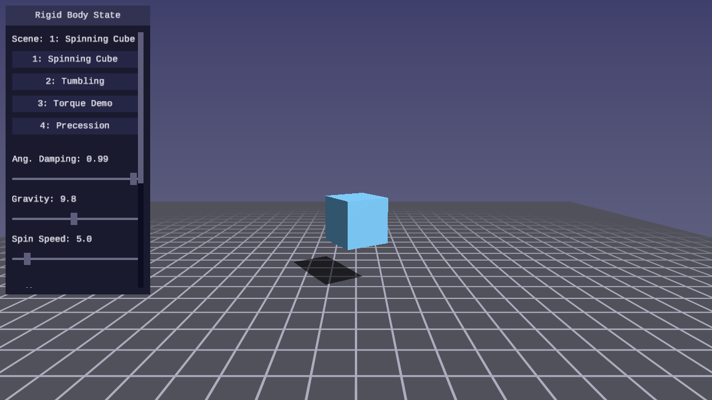
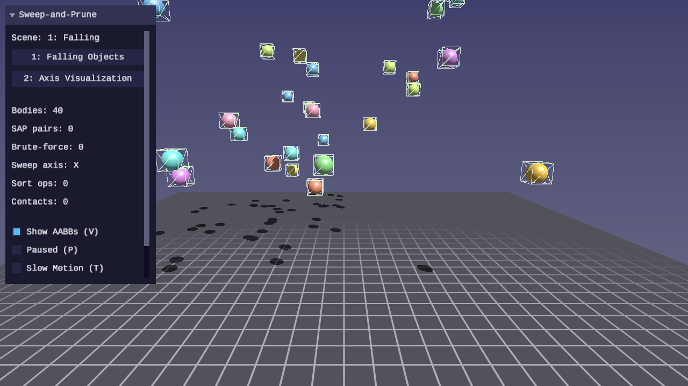
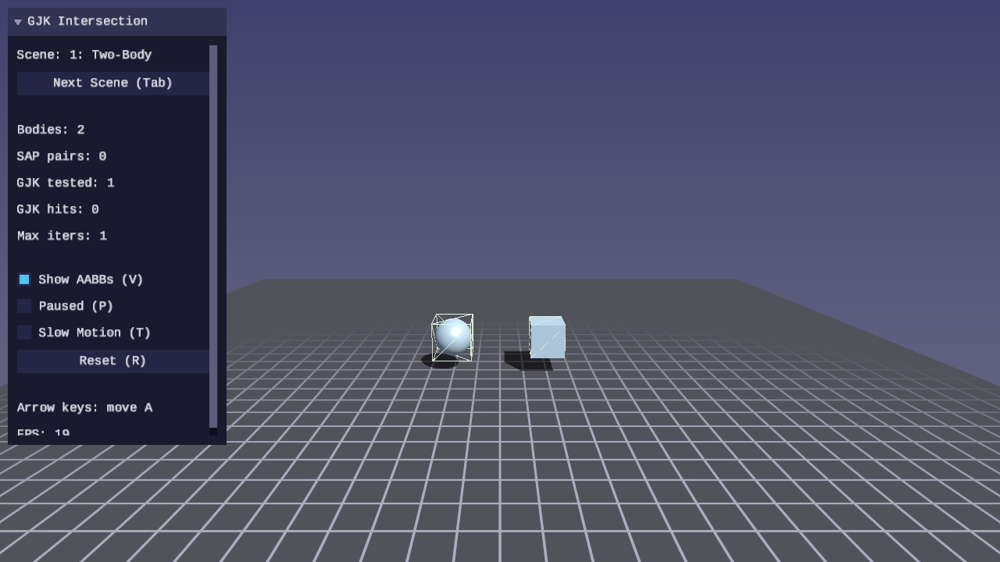
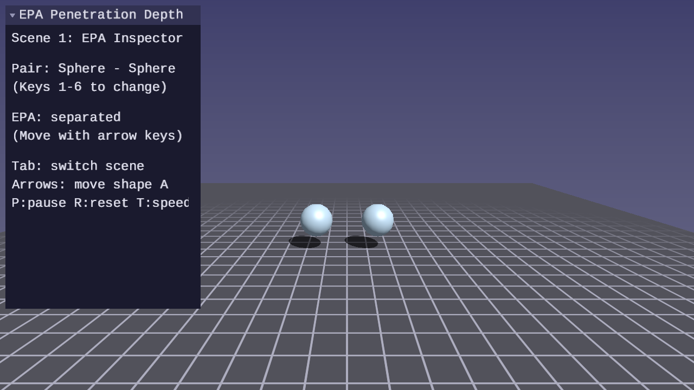
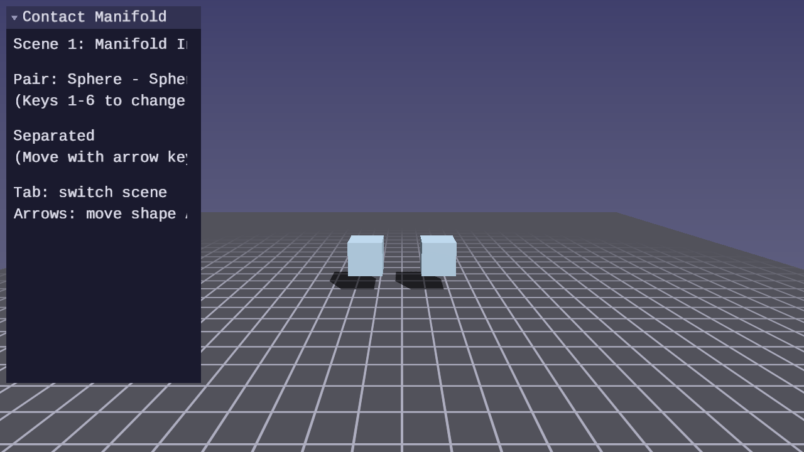
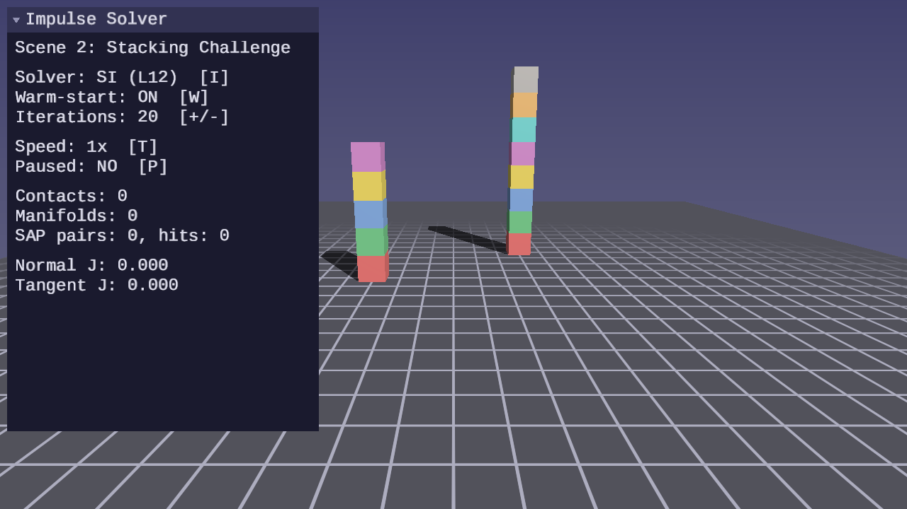
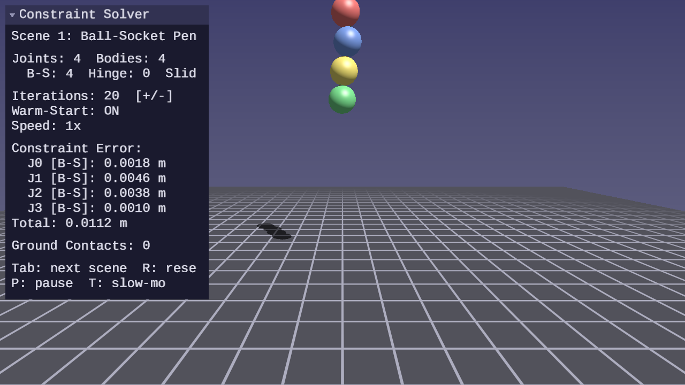

# Physics Lessons

Real-time physics simulation rendered with SDL GPU — particle dynamics, rigid
bodies, collision detection, and constraint solving.

## Purpose

Physics lessons teach how to simulate physical behavior and render it in
real time:

- Integrate particle motion with symplectic Euler
- Apply forces (gravity, drag, springs) via the force accumulator pattern
- Detect collisions between spheres, planes, boxes, and convex shapes
- Resolve contacts with impulse-based response and friction
- Build constraint solvers for joints and contacts
- Architect a complete simulation loop with fixed timestep and interpolation

Every lesson is a standalone interactive program with Blinn-Phong lighting,
a grid floor, shadow mapping, and first-person camera controls. The physics
is the focus — rendering uses simple geometric shapes (spheres, cubes,
capsules) so the simulation behavior is front and center.

## Philosophy

- **Simulate, then render** — Get the physics correct first, then visualize it.
  A correct simulation with simple shapes is better than a beautiful scene with
  broken physics.
- **Fixed timestep** — Physics runs at a fixed rate (60 Hz) decoupled from
  rendering. The accumulator pattern ensures identical behavior regardless of
  frame rate.
- **Interactive** — Every lesson supports pause (P), reset (R), and slow
  motion (T) so learners can observe and experiment with the simulation.
- **Library-driven** — `forge_physics.h` is the primary deliverable of every
  lesson. The lessons teach; the library is what remains. It must be robust,
  correct, performant, and tested. Every lesson extends it, and tests must
  pass before the demo program is written.

## Lessons

| | Lesson | About |
|---|--------|-------|
| [](01-point-particles/) | [**01 — Point Particles**](01-point-particles/) | Symplectic Euler integration, gravity, drag, sphere-plane collision, fixed timestep |
| [](02-springs-and-constraints/) | [**02 — Springs and Constraints**](02-springs-and-constraints/) | Hooke's law springs, damped oscillation, distance constraints, Gauss-Seidel solver, cloth simulation |
| [](03-particle-collisions/) | [**03 — Particle Collisions**](03-particle-collisions/) | Sphere-sphere detection, impulse-based response, coefficient of restitution, momentum conservation |
| [](04-rigid-body-state/) | [**04 — Rigid Body State**](04-rigid-body-state/) | Rigid body mass properties, inertia tensors, quaternion orientation, angular velocity, torque, integration |
| [](05-forces-and-torques/) | [**05 — Forces and Torques**](05-forces-and-torques/) | Force generators (gravity, drag, friction), forces at arbitrary points, torque from off-center forces, gyroscopic stability |
| [](06-resting-contacts-and-friction/) | [**06 — Resting Contacts and Friction**](06-resting-contacts-and-friction/) | Sphere-plane and box-plane contact detection, Coulomb friction (static and dynamic), iterative contact solver, Baumgarte stabilization, stacking |
| [](07-collision-shapes/) | [**07 — Collision Shapes and Support Functions**](07-collision-shapes/) | Collision shape tagged union, support functions (sphere, box, capsule), AABB computation from oriented shapes, AABB overlap testing, capsule inertia |
| [](08-sweep-and-prune/) | [**08 — Sweep-and-Prune Broadphase**](08-sweep-and-prune/) | Sort-and-sweep broadphase, endpoint sorting, axis selection by variance, SAP pair detection, brute-force comparison |
| [](09-gjk-intersection/) | [**09 — GJK Intersection Testing**](09-gjk-intersection/) | Gilbert-Johnson-Keerthi narrowphase, Minkowski difference, simplex evolution, support functions, SAP+GJK pipeline |
| [](10-epa-penetration-depth/) | [**10 — EPA Penetration Depth**](10-epa-penetration-depth/) | Expanding Polytope Algorithm, penetration depth and contact normal from GJK simplex, barycentric contact reconstruction, SAP+GJK+EPA pipeline |
| [](11-contact-manifold/) | [**11 — Contact Manifold**](11-contact-manifold/) | Sutherland-Hodgman clipping, multi-point contact generation from GJK/EPA, contact point reduction, manifold cache with persistent IDs, warm-starting |
| [](12-impulse-based-resolution/) | [**12 — Impulse-Based Resolution**](12-impulse-based-resolution/) | Sequential impulse solver, accumulated impulse clamping, warm-starting, manifold-aware resolution, per-axis Coulomb friction, Baumgarte stabilization, position correction |
| [](13-constraint-solver/) | [**13 — Constraint Solver**](13-constraint-solver/) | Joint constraints (ball-socket, hinge, slider), unified solver pipeline with contacts, warm-starting, position correction |

## Shared library

Physics lessons build on `common/physics/forge_physics.h` — a header-only
library that grows with each lesson. See
[common/physics/README.md](../../common/physics/README.md) for the API
reference.

## Controls

Every physics lesson uses the same control scheme:

| Key | Action |
|---|---|
| WASD / Arrows | Move camera |
| Mouse | Look around |
| R | Reset simulation |
| P | Pause / resume |
| T | Toggle slow motion |
| Escape | Release mouse / quit |

## Prerequisites

Physics lessons use the same build system as GPU lessons:

- CMake 3.24+
- A C compiler (MSVC, GCC, or Clang)
- A GPU with Vulkan, Direct3D 12, or Metal support
- Python 3 (for shader compilation and capture scripts)

## Building

```bash
cmake -B build
cmake --build build --config Debug

# Run a physics lesson
python scripts/run.py physics/01
```
