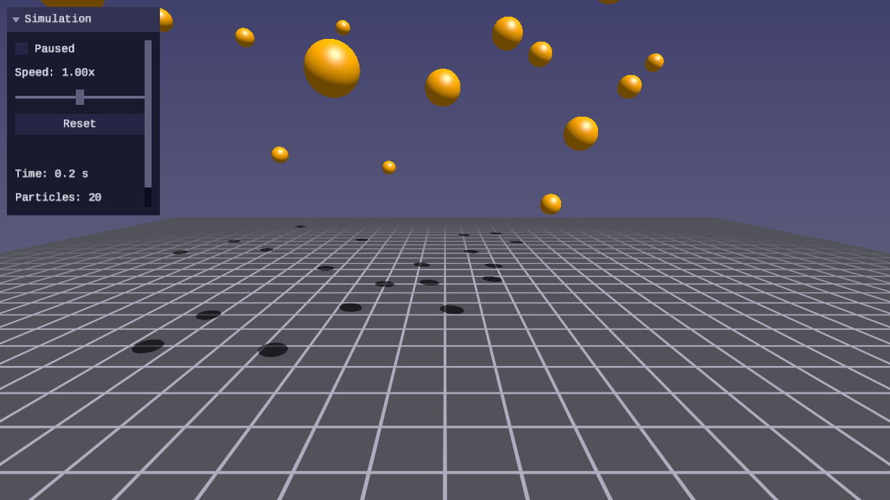
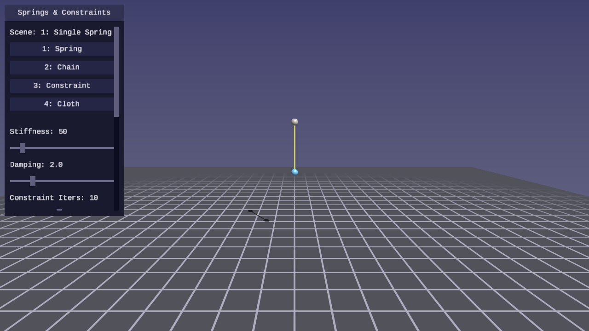
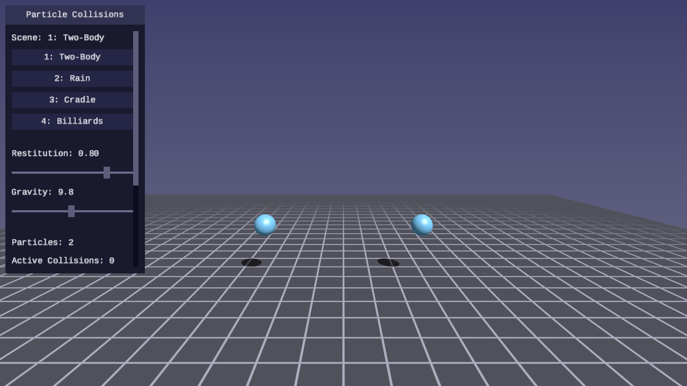

# Physics Lessons

Real-time physics simulation rendered with SDL GPU — particle dynamics, rigid
bodies, collision detection, and constraint solving.

## Purpose

Physics lessons teach how to simulate physical behavior and render it in
real time:

- Integrate particle motion with symplectic Euler
- Apply forces (gravity, drag, springs) via the force accumulator pattern
- Detect collisions between spheres, planes, boxes, and convex shapes
- Resolve contacts with impulse-based response and friction
- Build constraint solvers for joints and contacts
- Architect a complete simulation loop with fixed timestep and interpolation

Every lesson is a standalone interactive program with Blinn-Phong lighting,
a grid floor, shadow mapping, and first-person camera controls. The physics
is the focus — rendering uses simple geometric shapes (spheres, cubes,
capsules) so the simulation behavior is front and center.

## Philosophy

- **Simulate, then render** — Get the physics correct first, then visualize it.
  A correct simulation with simple shapes is better than a beautiful scene with
  broken physics.
- **Fixed timestep** — Physics runs at a fixed rate (60 Hz) decoupled from
  rendering. The accumulator pattern ensures identical behavior regardless of
  frame rate.
- **Interactive** — Every lesson supports pause (P), reset (R), and slow
  motion (T) so learners can observe and experiment with the simulation.
- **Library-driven** — `forge_physics.h` is the primary deliverable of every
  lesson. The lessons teach; the library is what remains. It must be robust,
  correct, performant, and tested. Every lesson extends it, and tests must
  pass before the demo program is written.

## Lessons

| | Lesson | About |
|---|--------|-------|
| [](01-point-particles/) | [**01 — Point Particles**](01-point-particles/) | Symplectic Euler integration, gravity, drag, sphere-plane collision, fixed timestep |
| [](02-springs-and-constraints/) | [**02 — Springs and Constraints**](02-springs-and-constraints/) | Hooke's law springs, damped oscillation, distance constraints, Gauss-Seidel solver, cloth simulation |
| [](03-particle-collisions/) | [**03 — Particle Collisions**](03-particle-collisions/) | Sphere-sphere detection, impulse-based response, coefficient of restitution, momentum conservation |

## Shared library

Physics lessons build on `common/physics/forge_physics.h` — a header-only
library that grows with each lesson. See
[common/physics/README.md](../../common/physics/README.md) for the API
reference.

## Controls

Every physics lesson uses the same control scheme:

| Key | Action |
|---|---|
| WASD / Arrows | Move camera |
| Mouse | Look around |
| R | Reset simulation |
| P | Pause / resume |
| T | Toggle slow motion |
| Escape | Release mouse / quit |

## Prerequisites

Physics lessons use the same build system as GPU lessons:

- CMake 3.24+
- A C compiler (MSVC, GCC, or Clang)
- A GPU with Vulkan, Direct3D 12, or Metal support
- Python 3 (for shader compilation and capture scripts)

## Building

```bash
cmake -B build
cmake --build build --config Debug

# Run a physics lesson
python scripts/run.py physics/01
```
