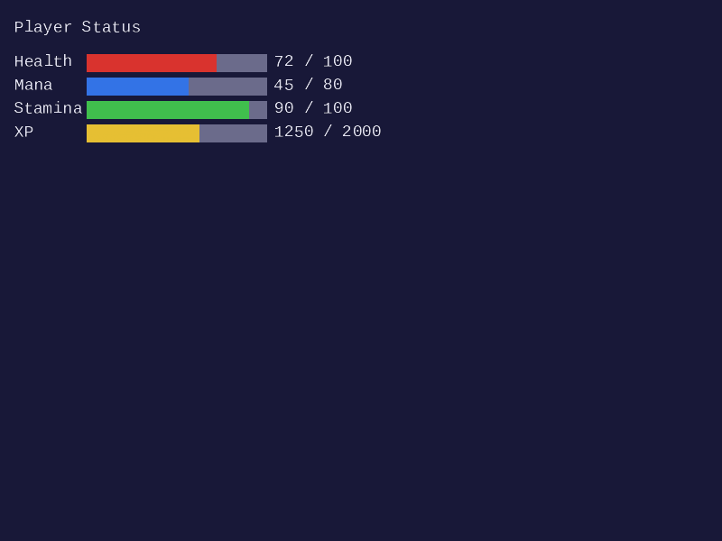
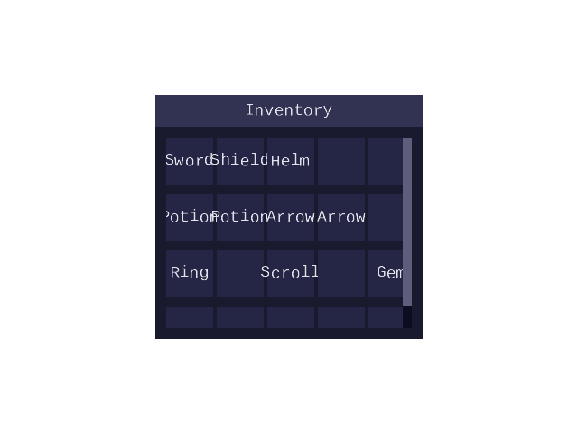
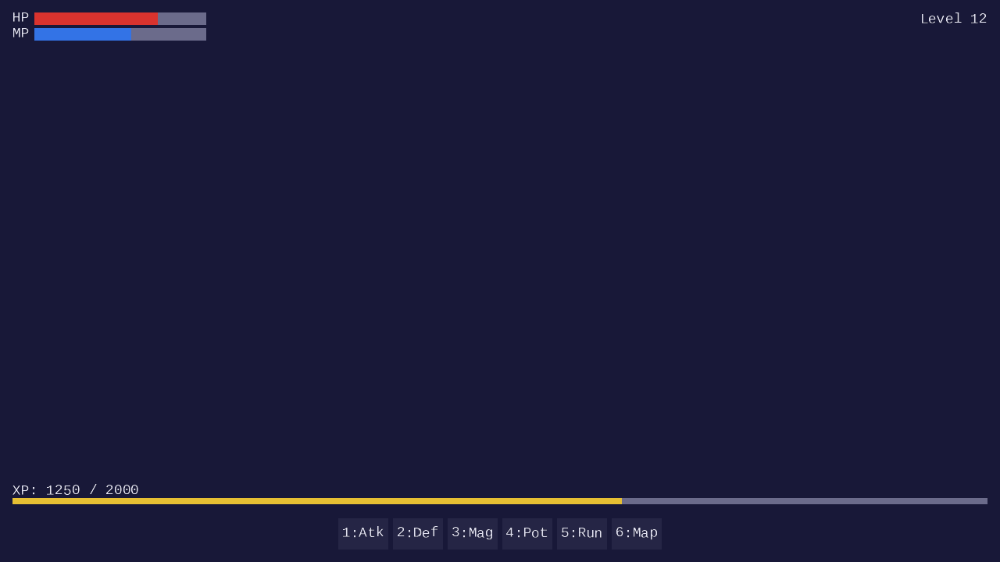
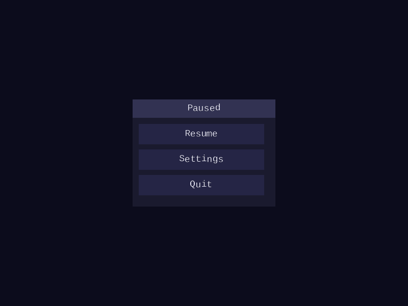

# UI Lesson 14 — Game UI

Compose the immediate-mode widgets from earlier lessons into common game UI
patterns: health bars, inventory grids, HUD anchoring, action bars, and pause
menus.

## What you will learn

- How to use `forge_ui_ctx_progress_bar()` for non-interactive status displays
  (health, mana, stamina)
- How to build an inventory grid with nested layouts — vertical rows containing
  horizontal columns of button cells
- How to anchor UI elements to screen edges using proportional offsets derived
  from the screen dimensions
- How to create an action bar — a centered horizontal row of ability buttons at
  the screen bottom
- How to implement a pause menu as a modal overlay with a dim background layer
  and a centered panel
- How to compute layout positions as fractions of screen size so the UI adapts
  to any resolution

## Why this matters

Individual widgets — buttons, sliders, checkboxes, panels — are building
blocks. A real game screen arranges dozens of them into recognizable patterns:
a health bar in the top-left corner, an inventory grid in a panel, a row of
ability icons along the bottom, a pause menu that dims the world and centers a
small options panel. Each of these patterns uses the same layout system, the
same widget functions, and the same immediate-mode loop from earlier lessons.

This lesson connects those pieces. The focus is on composition, not new
rendering code. Every element here is built from functions already in
`forge_ui_ctx.h` — two small additions to the library are
`forge_ui_ctx_progress_bar()`, a non-interactive filled bar simpler than a
slider, and `forge_ui_ctx_rect()`, a single solid-colored quad used for
overlays and dividers.

## Result

The demo program produces four BMP images showing common game UI compositions.

| Status Bars | Inventory |
|-------------|-----------|
|  |  |

| HUD Layout | Pause Menu |
|------------|------------|
|  |  |

**Status bars**: four progress bars (health, mana, stamina, XP) with labels
and numeric values. **Inventory**: a 5-column by 4-row grid of item slots in
a titled panel. **HUD layout**: full 1280x720 screen with HP/MP bars top-left,
level indicator top-right, XP bar spanning the bottom, and a centered action
bar with six ability buttons. **Pause menu**: a dim overlay with a centered
panel containing Resume, Settings, and Quit buttons.

## Key concepts

- **Progress bars** — a non-interactive filled rectangle that displays a ratio
  (current / max), used for health, mana, experience, and any stat that changes
  but is not user-controlled
- **Nested layouts** — a vertical layout containing horizontal layouts creates
  a grid; each row is a horizontal layout pushed inside the vertical parent
- **Screen-edge anchoring** — positioning elements relative to screen
  boundaries (top-left, bottom-center) rather than at absolute pixel
  coordinates, so the UI adapts to different window sizes
- **Modal overlays** — a full-screen semi-transparent quad drawn before the
  menu panel, blocking visual access to the content behind it
- **Proportional sizing** — expressing widget positions and sizes as fractions
  of screen width or height (e.g., `0.25f * screen_w` for a quarter-width
  panel) instead of fixed pixel values

## The details

### Progress bars

The `forge_ui_ctx_progress_bar()` function draws a non-interactive filled
rectangle representing a value within a range. It is the read-only counterpart
to the slider from [Lesson 06](../06-checkboxes-and-sliders/).

```c
void forge_ui_ctx_progress_bar(ForgeUiContext *ctx,
                                float value,
                                float max_val,
                                ForgeUiColor fill_color,
                                ForgeUiRect rect);
```

The function draws two quads: a background rectangle using the theme's
`border` color (matching the slider track), and a foreground fill whose width is proportional to
`value / max_val`. The `fill_color` parameter controls the foreground — red
for health, blue for mana, green for stamina, or any color the caller chooses.

The layout-aware variant `forge_ui_ctx_progress_bar_layout()` calls
`layout_next()` internally, so it works inside any layout region without
manual rect calculation.

When to use a progress bar vs a slider:

- **Progress bar**: the value is display-only — health, experience, loading
  progress, cooldown timers. The user cannot drag it.
- **Slider**: the value is user-editable — volume, brightness, sensitivity.
  The user drags the thumb to change it.

A typical status bar group combines labels and progress bars in a vertical
layout:

```c
forge_ui_ctx_layout_push(ctx, status_rect, FORGE_UI_LAYOUT_VERTICAL, 4.0f, 4.0f);

forge_ui_ctx_label_layout(ctx, "HP: 75 / 100", 20.0f);
forge_ui_ctx_progress_bar_layout(ctx, 75.0f, 100.0f, color_red, 16.0f);

forge_ui_ctx_label_layout(ctx, "MP: 40 / 80", 20.0f);
forge_ui_ctx_progress_bar_layout(ctx, 40.0f, 80.0f, color_blue, 16.0f);

forge_ui_ctx_label_layout(ctx, "Stamina: 90 / 100", 20.0f);
forge_ui_ctx_progress_bar_layout(ctx, 90.0f, 100.0f, color_green, 16.0f);

forge_ui_ctx_layout_pop(ctx);
```

### HUD anchoring

A HUD (heads-up display) places UI elements at the edges and corners of the
screen. The key idea is to compute widget positions relative to the screen
boundaries rather than using fixed coordinates. This way, the layout adapts
when the window is resized.

Four anchor points cover most HUD layouts:

```text
top-left                                    top-right
  (margin, margin)                            (screen_w - width - margin, margin)

bottom-left                                 bottom-center
  (margin, screen_h - height - margin)        ((screen_w - width) / 2, screen_h - height - margin)
```

In code, define a margin and compute each region's rect from the screen
dimensions:

```c
#define HUD_MARGIN  16.0f

/* Status bars: top-left corner */
float status_w = 200.0f;
float status_h = 160.0f;
ForgeUiRect status_rect = {
    HUD_MARGIN,
    HUD_MARGIN,
    status_w,
    status_h
};

/* Minimap: top-right corner */
float minimap_size = 150.0f;
ForgeUiRect minimap_rect = {
    screen_w - minimap_size - HUD_MARGIN,
    HUD_MARGIN,
    minimap_size,
    minimap_size
};
```

The positions are recomputed every frame, so if the window is resized, the
elements stay anchored to their respective corners. No retained layout state
is needed — the immediate-mode loop recalculates everything.

### Inventory grids

An inventory grid is a two-dimensional arrangement of item slots. The layout
system handles this with nesting: a vertical layout for rows, each containing
a horizontal layout for columns.

```c
#define INV_COLS     5
#define INV_ROWS     4
#define SLOT_SIZE   48.0f
#define SLOT_GAP     4.0f

if (forge_ui_ctx_panel_begin(ctx, "Inventory", inv_rect, &inv_scroll)) {

/* The panel pushes a vertical layout internally.
 * Each row is a horizontal layout containing INV_COLS slots. */
for (int row = 0; row < INV_ROWS; row++) {
    float row_w = INV_COLS * SLOT_SIZE + (INV_COLS - 1) * SLOT_GAP;
    ForgeUiRect row_rect = forge_ui_ctx_layout_next(ctx, SLOT_SIZE);

    forge_ui_ctx_layout_push(ctx, row_rect, FORGE_UI_LAYOUT_HORIZONTAL,
                              -1.0f, SLOT_GAP);

    for (int col = 0; col < INV_COLS; col++) {
        int slot_index = row * INV_COLS + col;
        const char *item_name = inventory[slot_index]; /* NULL if empty */

        if (item_name) {
            if (forge_ui_ctx_button_layout(ctx, item_name, SLOT_SIZE)) {
                selected_slot = slot_index;
            }
        } else {
            /* Empty slot — unique ID per cell so each has its own state */
            char empty_id[32];
            SDL_snprintf(empty_id, sizeof(empty_id), " ##empty_%d", slot_index);
            forge_ui_ctx_button_layout(ctx, empty_id, SLOT_SIZE);
        }
    }

    forge_ui_ctx_layout_pop(ctx);
}

    forge_ui_ctx_panel_end(ctx);
}
```

The outer vertical layout spaces the rows; each horizontal row layout spaces
the columns. The panel provides clipping and scrolling when the grid exceeds
the visible area — the same nesting pattern from
[Lesson 08](../08-layout/).

### Action bars

An action bar is a horizontal row of ability buttons centered at the bottom
of the screen. The centering is computed from the screen width and the total
bar width:

```c
#define ACTION_BTN_SIZE   48.0f
#define ACTION_BTN_GAP     6.0f
#define ACTION_COUNT       6

float bar_w = ACTION_COUNT * ACTION_BTN_SIZE
            + (ACTION_COUNT - 1) * ACTION_BTN_GAP;
float bar_x = (screen_w - bar_w) * 0.5f;
float bar_y = screen_h - ACTION_BTN_SIZE - HUD_MARGIN;

ForgeUiRect bar_rect = { bar_x, bar_y, bar_w, ACTION_BTN_SIZE };

forge_ui_ctx_layout_push(ctx, bar_rect, FORGE_UI_LAYOUT_HORIZONTAL,
                          -1.0f, ACTION_BTN_GAP);

const char *abilities[] = { "Q", "W", "E", "R", "D", "F" };
for (int i = 0; i < ACTION_COUNT; i++) {
    if (forge_ui_ctx_button_layout(ctx, abilities[i], ACTION_BTN_SIZE)) {
        SDL_Log("Ability %s activated", abilities[i]);
    }
}

forge_ui_ctx_layout_pop(ctx);
```

The bar is centered horizontally with `(screen_w - bar_w) * 0.5f`. If the
window is resized, the bar re-centers automatically.

### Pause menus

A pause menu is a modal overlay: a full-screen dim layer drawn over the game
HUD, with a centered panel on top. The dim layer is a single quad covering the
entire screen with a semi-transparent dark color:

```c
if (game_paused) {
    /* Dim overlay — a single semi-transparent black quad.
     * forge_ui_ctx_rect emits one quad with no background track,
     * so the overlay blends correctly against the scene. */
    ForgeUiRect overlay = { 0, 0, screen_w, screen_h };
    ForgeUiColor dim = { 0.0f, 0.0f, 0.0f, 0.5f };
    forge_ui_ctx_rect(ctx, overlay, dim);

    /* Centered pause panel */
    float menu_w = 250.0f;
    float menu_h = 200.0f;
    float menu_x = (screen_w - menu_w) * 0.5f;
    float menu_y = (screen_h - menu_h) * 0.5f;
    ForgeUiRect menu_rect = { menu_x, menu_y, menu_w, menu_h };

    if (forge_ui_ctx_panel_begin(ctx, "Paused", menu_rect, &pause_scroll)) {
        if (forge_ui_ctx_button_layout(ctx, "Resume", 36.0f)) {
            game_paused = false;
        }
        if (forge_ui_ctx_button_layout(ctx, "Settings", 36.0f)) {
            show_settings = true;
        }
        if (forge_ui_ctx_button_layout(ctx, "Quit", 36.0f)) {
            should_quit = true;
        }
        forge_ui_ctx_panel_end(ctx);
    }
}
```

Draw order in immediate mode determines visual layering — later draws appear
in front. The overlay draws after the HUD, and the panel draws after the
overlay. This pattern extends to any modal: confirmation dialogs, loot
windows, or tooltip popups.

### Proportional layout

Hard-coded pixel positions break when the window is resized. Proportional
layout avoids this by expressing positions and sizes as fractions of the
screen dimensions:

```c
/* Status panel: 25% of screen width, 20% of screen height */
float status_w = 0.25f * screen_w;
float status_h = 0.20f * screen_h;

/* Action bar: 40% of screen width, centered */
float bar_w = 0.40f * screen_w;
float bar_x = (screen_w - bar_w) * 0.5f;

/* Inventory panel: 30% of screen width, 60% of screen height, right side */
float inv_w = 0.30f * screen_w;
float inv_h = 0.60f * screen_h;
float inv_x = screen_w - inv_w - HUD_MARGIN;
```

This approach has a limit: very small windows may squeeze widgets below their
minimum readable size. A common safeguard is to clamp computed sizes to a
minimum (e.g., `if (status_w < 180.0f) status_w = 180.0f`).

The immediate-mode loop recomputes all positions every frame, so there is no
stale layout data to invalidate. Query `screen_w` and `screen_h` at the start
of each frame and all positions update automatically.

## Data output

The demo produces standard UI vertex/index data identical to previous lessons:

- **Vertices**: `ForgeUiVertex` — position (x, y), UV (u, v), color
  (r, g, b, a) — 32 bytes per vertex
- **Indices**: `uint32_t` triangle list, counter-clockwise winding
- **Textures**: grayscale font atlas (single-channel alpha), same as all
  previous UI lessons

The output BMP images are rendered via `forge_raster_triangles_indexed` from
`common/raster/`. In a real application, this vertex data uploads to the GPU
as described in [GPU Lesson 28](../../gpu/28-ui-rendering/).

## Where it is used

- [GPU Lesson 28 — UI Rendering](../../gpu/28-ui-rendering/) renders UI
  vertex data on the GPU with a single draw call — the game UI compositions
  from this lesson produce the same vertex format
- [UI Lesson 08 — Layout](../08-layout/) introduced the layout stack and
  nesting — the inventory grid and action bar patterns depend on it
- [UI Lesson 09 — Panels and Scrolling](../09-panels-and-scrolling/) introduced
  panels with clipping and scroll — the inventory panel and pause menu use them
- [UI Lesson 05 — Immediate-Mode Basics](../05-immediate-mode-basics/)
  introduced the hot/active state machine — every interactive widget here
  (buttons in the action bar, inventory slots) uses it
- [UI Lesson 06 — Checkboxes and Sliders](../06-checkboxes-and-sliders/)
  introduced the slider — the progress bar is its non-interactive counterpart
- [UI Lesson 13 — Theming and Color System](../13-theming-and-color-system/)
  introduced the theme — all widgets read colors from `ctx->theme`

## Building

```bash
cmake -B build
cmake --build build --target 14-game-ui

# Windows
build\lessons\ui\14-game-ui\Debug\14-game-ui.exe

# Linux / macOS
./build/lessons/ui/14-game-ui/14-game-ui
```

Output: `status_bars.bmp`, `inventory.bmp`, `hud.bmp`, and `pause_menu.bmp`
in the working directory.

## Exercises

1. **Experience bar with level label**: Add an experience progress bar below
   the health/mana/stamina group. Display the current level as a label to the
   left of the bar (e.g., "Lv. 12") and the XP fraction to the right
   (e.g., "3400 / 5000"). Use a horizontal layout to place the label, bar,
   and fraction side by side.

2. **Drag-to-swap inventory**: Extend the inventory grid so that clicking a
   slot selects it (highlighted border), and clicking a second slot swaps the
   two items. Track `selected_slot` as application state and highlight the
   selected cell with the theme's `accent` color.

3. **Tooltip on hover**: When the mouse hovers over an occupied inventory slot,
   draw a small label below the cursor showing the item name and a one-line
   description. Use `forge_ui_ctx_label()` with a manual position offset from
   `ctx->mouse_x` / `ctx->mouse_y`. Handle the case where the tooltip would
   extend past the right or bottom screen edge by flipping its anchor.

4. **Resolution stress test**: Run the demo at three different screen sizes
   (640x480, 1280x720, 1920x1080) and verify that all HUD elements remain
   visible, readable, and correctly anchored. Identify any elements that
   overlap or get clipped at small sizes and add minimum-size clamps to fix
   them.

## What's next

[UI Lesson 15 — Dev UI](../15-dev-ui/) builds developer-facing tools:
collapsible tree nodes for scene hierarchies, property inspectors and editable
property editors with drag-float/drag-int fields, scrollable console logs with
colored severity levels, sparkline graphs for performance overlays, selection
controls (listbox, dropdown, radio buttons), and an HSV color picker.

## Further reading

- [UI Lesson 08 — Layout](../08-layout/) covers the layout stack in detail,
  including vertical, horizontal, padding, and spacing
- [UI Lesson 09 — Panels and Scrolling](../09-panels-and-scrolling/) explains
  panel clipping, scroll offsets, and scrollbar interaction
- [UI Lesson 06 — Checkboxes and Sliders](../06-checkboxes-and-sliders/)
  explains the slider interaction pattern that the progress bar simplifies
- [UI Lesson 13 — Theming and Color System](../13-theming-and-color-system/)
  covers the theme struct and WCAG contrast validation
- [Math Lesson 01 — Vectors](../../math/01-vectors/) covers the 2D vector
  arithmetic used in rect positioning
