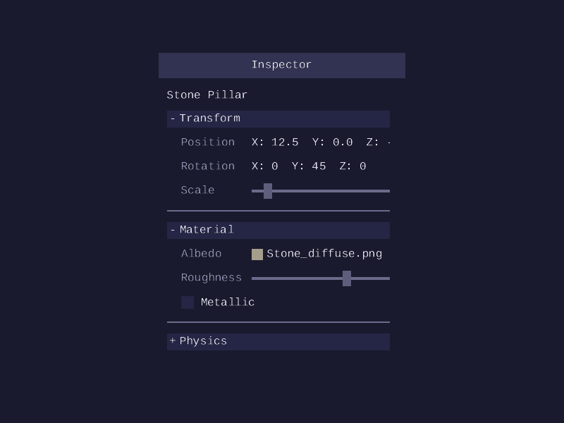
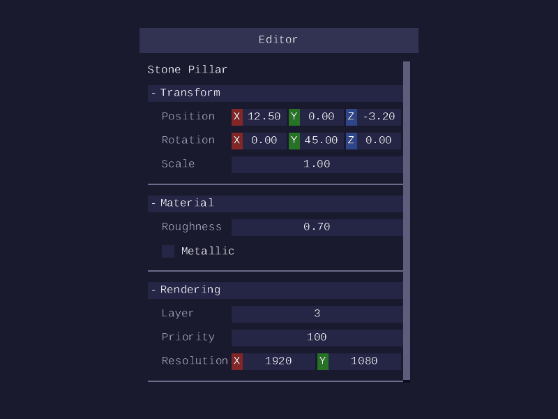
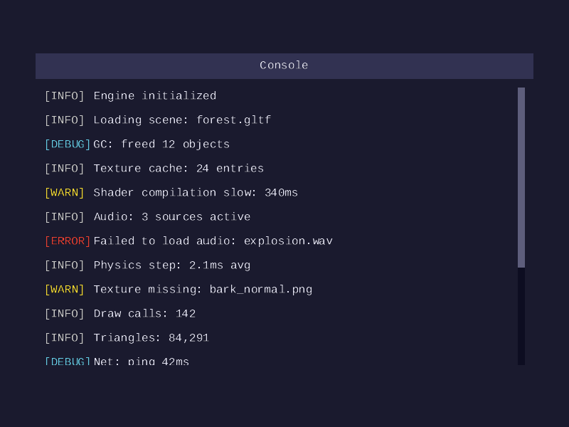
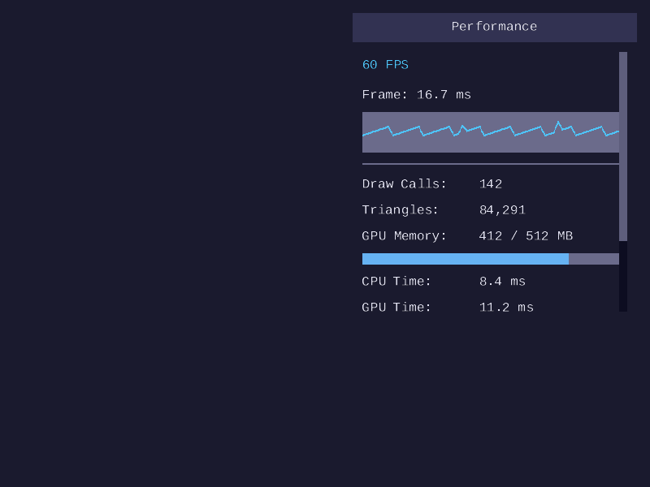
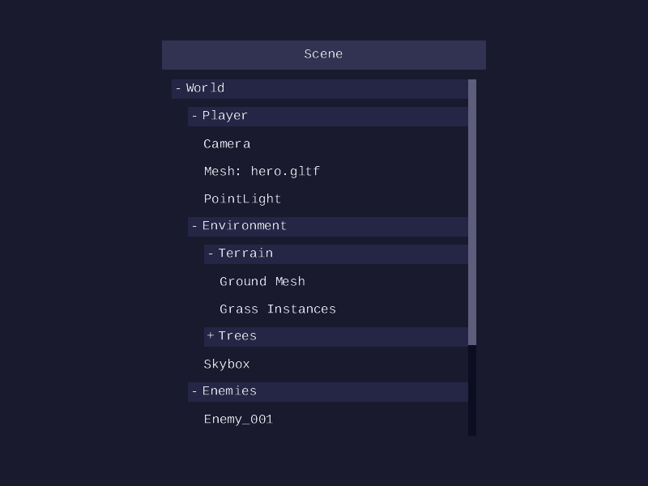
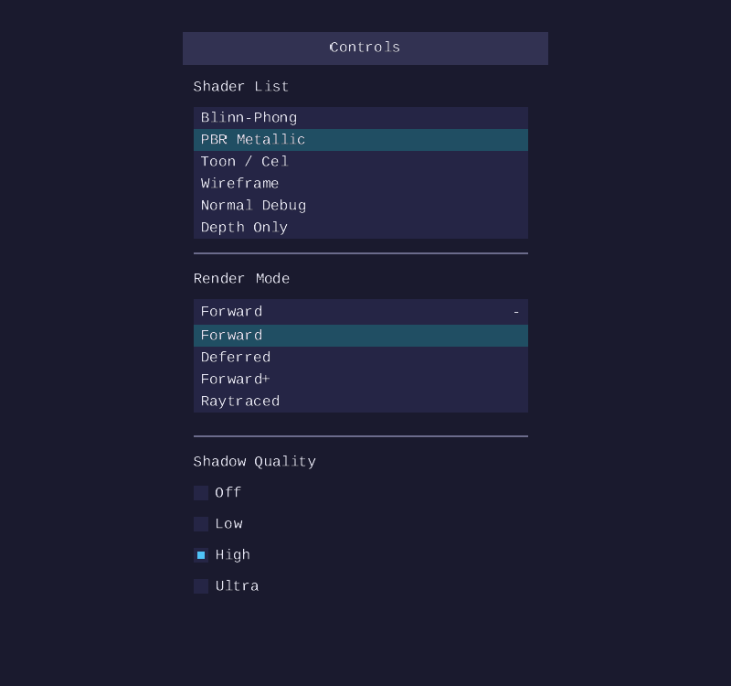
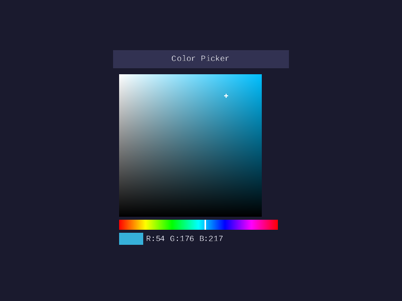

# UI Lesson 15 — Dev UI

Build developer-facing tools for runtime inspection and editing: property
inspectors, editable property editors with drag-value fields, debug consoles,
performance overlays, scene tree views, selection controls, and color pickers.

## What you will learn

- How to use `forge_ui_ctx_tree_push()` / `tree_pop()` for collapsible sections
  that show or hide child content on click
- How to build a read-only property inspector by composing tree nodes, labels,
  sliders, and checkboxes into a panel
- How to build an editable property editor using `forge_ui_ctx_drag_float()` and
  `forge_ui_ctx_drag_int()` for click-drag value fields, including
  multi-component variants (`drag_float_n`, `drag_int_n`)
- How to create a scrollable console log with colored severity levels using
  `forge_ui_ctx_label_colored()`
- How to display performance metrics with `forge_ui_ctx_sparkline()` for frame
  time graphs and `forge_ui_ctx_progress_bar()` for resource usage
- How to render a hierarchical scene tree with indented tree nodes at multiple
  nesting depths
- How to use `forge_ui_ctx_listbox()` for clipped item selection,
  `forge_ui_ctx_dropdown()` for compact combo boxes, and
  `forge_ui_ctx_radio()` for exclusive-choice groups
- How to use `forge_ui_ctx_color_picker()` for HSV color selection with a
  saturation-value gradient, hue bar, and live preview swatch
- How to use `forge_ui_ctx_separator()` to visually divide sections within a
  panel

## Why this matters

Game developers spend most of their time iterating: adjusting a light color,
watching a physics value settle, tracking down a warning buried in the log. The
tools that support this workflow — property editors, consoles, performance
overlays, scene tree inspectors — are what make the difference between hunting
through code to change a constant and tweaking it live. Every commercial engine
ships some version of these panels, and they all follow the same structural
pattern: a scrollable panel containing a vertical column of labeled widgets,
built from the same primitives used everywhere else in the UI.

This lesson demonstrates that pattern. The seven demo panels are composed from
widgets introduced in earlier lessons — labels, sliders, checkboxes, progress
bars, panels, and layouts — plus several new additions: drag-value fields for
inline numeric editing, listboxes and dropdowns for item selection, radio
buttons for exclusive choices, and an HSV color picker with gradient rendering.
Collapsible tree nodes group related properties, a sparkline graph shows
time-series data, and separator lines provide visual structure. The point is
not that these additions are complex — they are not — but that a small set of
composable widgets covers a wide range of developer tooling.

## Result

The demo program produces seven BMP images showing common developer UI
patterns.

| Property Inspector | Property Editor |
|--------------------|-----------------|
|  |  |

| Console | Performance Overlay |
|---------|---------------------|
|  |  |

| Scene Tree | Controls |
|------------|----------|
|  |  |

| Color Picker |
|--------------|
|  |

**Property inspector**: a read-only panel with three collapsible sections —
Transform, Material, and Physics — containing sliders, checkboxes, and labels
for viewing component values. Transform and Material are expanded, showing
position/scale sliders, an albedo color swatch, roughness slider, and metallic
checkbox. Physics is collapsed, showing only its header with a `+` indicator.
**Property editor**: an editable panel using drag-value fields instead of
sliders. Transform shows `drag_float_n` for position (3 components) and
rotation (3 components), plus a single `drag_float` for scale. Material uses
`drag_float` for roughness. Rendering uses `drag_int` for layer and priority,
and `drag_int_n` for resolution (2 components). **Console**: a scrollable log
viewer with colored severity tags. Each line is prefixed with a tag — light
gray for INFO, yellow for WARN, red for ERROR, cyan for DEBUG — followed by
the message text in the default theme color. **Performance overlay**: a compact
panel showing FPS count, a sparkline graph of the last 60 frame times, draw
call and triangle counts, and a memory usage progress bar. **Scene tree**: a
hierarchical view of game objects. The World node expands to reveal children
(Player, Environment, Enemies), and Player expands further to show sub-objects
(Camera, Mesh: hero.gltf, PointLight), each indented by depth. **Controls**: a
panel with three selection widget types — a listbox showing shader options, a
dropdown combo box for render mode (shown expanded), and radio buttons for
shadow quality. **Color picker**: an HSV color picker with a saturation-value
gradient area, a horizontal hue slider bar, and a color preview swatch with
RGB value readout.

## Key concepts

- **Collapsible tree nodes** — a clickable header row with a `+`/`-` indicator
  that toggles a caller-owned bool, controlling whether the section's children
  are emitted. Built on the same hot/active state machine from
  [Lesson 05](../05-immediate-mode-basics/).
- **Property inspectors** — panels composed of tree nodes, sliders, checkboxes,
  and labels arranged in a vertical layout. No new widget type — pure
  composition of existing primitives from
  [Lesson 06](../06-checkboxes-and-sliders/) and
  [Lesson 08](../08-layout/).
- **Drag-value fields** — numeric fields edited by click-dragging horizontally.
  The mouse delta is multiplied by a speed factor and added to the current
  value, clamped to a min/max range. Multi-component variants (`drag_float_n`,
  `drag_int_n`) divide the available width evenly among N fields.
- **Console log** — a vertical list of colored label pairs (severity tag +
  message text) inside a scrollable panel from
  [Lesson 09](../09-panels-and-scrolling/). The panel's clip rect and scroll
  offset handle overflow.
- **Sparkline graphs** — a mini line chart rendered as a series of column quads
  mapping float values to vertical positions within a small rectangle. Useful
  for any metric that varies over time.
- **Selection controls** — listbox (clipped item list with click selection),
  dropdown (collapsed header that expands to show items), and radio buttons
  (exclusive-choice boxes with filled inner square when selected). Listbox
  and dropdown modify a caller-owned `int *selected` index, while
  `forge_ui_ctx_radio()` writes the caller-provided `option_value` (an
  arbitrary `int`) into the caller's `*selected` variable.
- **HSV color picker** — a saturation-value gradient area rendered with
  per-vertex color interpolation, a horizontal hue bar using gradient rects,
  and a preview swatch showing the selected color with RGB readout. Uses
  `forge_ui_hsv_to_rgb` and `forge_ui_rgb_to_hsv` for color space conversion.
- **Separator lines** — a single-pixel horizontal line drawn at the theme's
  border color, providing visual grouping between sections without consuming
  significant vertical space.
- **Hierarchical indentation** — nested tree nodes at increasing depth, where
  each level is offset by a fixed horizontal indent. Leaf nodes without children
  use a plain label at the same indentation.

## The details

### Collapsible tree nodes

A tree node is a clickable header that shows or hides its children. The pattern
is similar to a checkbox — the widget modifies a caller-owned `bool *open`
value — but the visual presentation is a full-width row with a `+`/`-` text
indicator on the left and the section label to its right.

The API has two functions: `tree_push` opens the scope, `tree_pop` closes it.

```c
bool transform_open = true;

if (forge_ui_ctx_tree_push_layout(&ctx, "Transform", &transform_open, ROW_HEIGHT)) {
    /* Children are only emitted when the section is expanded */
    forge_ui_ctx_slider_layout(&ctx, "Pos X##xform", &pos_x, -100.0f, 100.0f, ROW_HEIGHT);
    forge_ui_ctx_slider_layout(&ctx, "Pos Y##xform", &pos_y, -100.0f, 100.0f, ROW_HEIGHT);
    forge_ui_ctx_slider_layout(&ctx, "Scale##xform", &scale, 0.1f, 10.0f, ROW_HEIGHT);
}
forge_ui_ctx_tree_pop(&ctx);  /* always called, even when collapsed */
```

`tree_push_layout` does three things:

1. **Draws the header row** — a `+` or `-` indicator followed by the label
   text, with hover and active highlighting using the standard hot/active state
   machine from [Lesson 05](../05-immediate-mode-basics/).
2. **Toggles the bool on click** — when the user clicks the header row, the
   pointed-to bool flips. This is the same external mutable state pattern used
   by checkboxes in [Lesson 06](../06-checkboxes-and-sliders/).
3. **Pushes an ID scope** — the label string is pushed onto the ID stack so
   that child widgets with common names (like `"Scale"` appearing in multiple
   sections) remain unique. This uses the ID system from
   [Lesson 11](../11-widget-id-system/).

The return value is the current open state. When `false`, the caller skips
emitting children — they simply are not part of this frame's UI. When `true`,
the caller emits whatever widgets belong inside the section.

`tree_pop` must always be called regardless of whether the section is open. It
pops the ID scope pushed by `tree_push` and restores the layout state. Omitting
it would corrupt the ID stack and misalign subsequent widgets.

The `+`/`-` indicator is drawn as a text label at a fixed width on the left
side of the row. Hit testing covers the entire row rectangle, not just the
indicator — clicking anywhere on the header toggles the section. This follows
the same convention as checkbox labels, where the clickable area extends across
the full widget width.

### Property inspectors and editors

A property inspector is a panel filled with collapsible sections, each grouping
related properties. This is the pattern used by inspector panels in Unity,
Unreal, and Godot — a vertical column of labeled controls where each section
can be collapsed to reduce clutter.

The read-only inspector uses sliders, checkboxes, and labels to display values.
The editable property editor replaces sliders with drag-value fields — the user
clicks and drags horizontally to change a value, with the mouse delta multiplied
by a configurable speed factor.

```c
if (forge_ui_ctx_panel_begin(&ctx, "Editor", panel_rect, &scroll_y)) {

    /* Transform section with drag-float fields */
    if (forge_ui_ctx_tree_push_layout(&ctx, "Transform", &xform_open, ROW_HEIGHT)) {
        float pos[3] = { 12.5f, 0.0f, -3.2f };
        forge_ui_ctx_drag_float_n(&ctx, "##pos", pos, 3, 0.1f, -100.0f, 100.0f, field);

        float scale = 1.0f;
        forge_ui_ctx_drag_float(&ctx, "##scale", &scale, 0.01f, 0.01f, 100.0f, field);
    }
    forge_ui_ctx_tree_pop(&ctx);

    /* Rendering section with drag-int fields */
    if (forge_ui_ctx_tree_push_layout(&ctx, "Rendering", &render_open, ROW_HEIGHT)) {
        int layer = 3;
        forge_ui_ctx_drag_int(&ctx, "##layer", &layer, 0.2f, 0, 31, field);

        int resolution[2] = { 1920, 1080 };
        forge_ui_ctx_drag_int_n(&ctx, "##res", resolution, 2, 1.0f, 1, 8192, field);
    }
    forge_ui_ctx_tree_pop(&ctx);

    forge_ui_ctx_panel_end(&ctx);
}
```

The `drag_float_n` and `drag_int_n` variants divide the available width evenly
among 1..4 fields, drawing each as an independent drag target. Counts outside
this range are rejected (the function returns `false` with no draw data emitted).
This is useful for vector components (position, rotation, resolution) where the
values are related but edited independently.

### Console and log viewers

A console log displays timestamped messages with severity-based coloring. Each
entry is two pieces of text on a single row: a short colored tag indicating the
severity level, and the message body in the default theme text color.

The severity colors follow a common convention:

```text
INFO   — light gray (routine status messages)
WARN   — yellow    (non-fatal issues worth noting)
ERROR  — red       (failures requiring attention)
DEBUG  — cyan      (verbose diagnostic output)
```

The implementation iterates over a log buffer and emits one row per entry. The
colored tag uses `forge_ui_ctx_label_colored()` from
[Lesson 13](../13-theming-and-color-system/), and the message text uses the
standard `forge_ui_ctx_label()`.

```c
typedef struct LogEntry {
    const char *level;         /* "[INFO]", "[WARN]", "[ERROR]", "[DEBUG]" */
    const char *message;       /* human-readable log message */
    float r, g, b;             /* color for the severity tag */
} LogEntry;

/* Inside a scrollable panel */
if (forge_ui_ctx_panel_begin(&ctx, "Console", console_rect, &console_scroll)) {
    float ascender_px = forge_ui__ascender_px(ctx.atlas);

    for (int i = 0; i < log_count; i++) {
        ForgeUiRect row = forge_ui_ctx_layout_next(&ctx, ROW_HEIGHT);
        float text_y = row.y + (row.h - ctx.atlas->pixel_height) * 0.5f
                      + ascender_px;

        /* Severity tag on the left (fixed width) */
        forge_ui_ctx_label_colored(&ctx, log[i].level,
                                   row.x, text_y,
                                   log[i].r, log[i].g, log[i].b, 1.0f);

        /* Message text to the right of the tag */
        forge_ui_ctx_label(&ctx, log[i].message,
                           row.x + TAG_WIDTH, text_y);
    }

    forge_ui_ctx_panel_end(&ctx);
}
```

The panel's scroll offset and clip rect from
[Lesson 09](../09-panels-and-scrolling/) handle the case where the log has more
entries than fit in the visible area. Older entries scroll out of view as new
ones are appended. The scroll position can be locked to the bottom so the most
recent entry is always visible — this is a single comparison: if `scroll_y` is
at its maximum before appending, advance it by one row height after.

### Sparklines and performance overlays

A sparkline is a small inline graph that shows a value changing over time. The
`forge_ui_ctx_sparkline()` widget takes an array of float values, a count, and
a min/max range, then renders the data as a series of 1-pixel-wide column quads
inside the given rect.

For each consecutive pair of values `values[i]` and `values[i+1]`, the widget
computes the vertical position of each endpoint by mapping the value from the
`[min_val, max_val]` range into the rect's pixel height. It then draws a quad
spanning from one column to the next, with the top and bottom edges set by the
two mapped values. The result looks like a continuous line chart made of thin
vertical slices.

```c
/* Map a value to a pixel Y position within the rect */
float t = (values[i] - min_val) / (max_val - min_val);
float y = rect.y + rect.h - t * rect.h;   /* bottom-up: 0 at bottom, 1 at top */
```

The layout variant (`forge_ui_ctx_sparkline_layout`) uses `layout_next` to
obtain its rect automatically, taking only the height as a parameter.

A performance overlay composes several existing widgets into a compact
monitoring panel:

- **FPS label** — `forge_ui_ctx_label()` with the current frames-per-second
- **Frame time sparkline** — `forge_ui_ctx_sparkline_layout()` showing a
  rolling window of frame durations
- **Stat labels** — draw call count, triangle count, displayed as label pairs
- **GPU memory bar** — `forge_ui_ctx_progress_bar_layout()` showing memory
  usage as a filled fraction

No new widget type is needed — the overlay is pure composition inside a panel
with a vertical layout.

### Selection controls

Three widget types handle item selection, each suited to different contexts:

**Listbox** — a clipped list where each item is a clickable row. The
currently selected item is highlighted with a tinted accent fill (the theme's
accent color scaled to 40% intensity). Items that overflow the rect are clipped
and unreachable; for scrolling, place the listbox inside a panel. Useful when
the user needs to see all options at once.

```c
static const char *const shaders[] = {
    "Blinn-Phong", "PBR Metallic", "Toon / Cel",
    "Wireframe", "Normal Debug", "Depth Only"
};
int selected = 1;
forge_ui_ctx_listbox_layout(&ctx, "##shaders", &selected, shaders, 6, list_h);
```

**Dropdown** — a compact header showing the current selection. When clicked, it
expands to show the full item list below the header. The caller owns a
`bool *open` controlling the expanded state.

```c
static const char *const modes[] = { "Forward", "Deferred", "Forward+", "Raytraced" };
int mode = 0;
bool open = false;
forge_ui_ctx_dropdown_layout(&ctx, "##mode", &mode, &open, modes, 4, header_h);
```

**Radio buttons** — a group of labeled indicators where only one can be selected
at a time. Each radio button compares its `option_value` against `*selected`;
clicking it sets `*selected` to that value. The indicator uses the same
rectangular quad rendering as checkboxes — an outer box with an inner filled
square when selected.

```c
int quality = 2;
forge_ui_ctx_radio_layout(&ctx, "Off",   &quality, 0, ROW_HEIGHT);
forge_ui_ctx_radio_layout(&ctx, "Low",   &quality, 1, ROW_HEIGHT);
forge_ui_ctx_radio_layout(&ctx, "High",  &quality, 2, ROW_HEIGHT);
forge_ui_ctx_radio_layout(&ctx, "Ultra", &quality, 3, ROW_HEIGHT);
```

All three widgets modify a caller-owned `int *selected` value, following the
same external mutable state pattern used by checkboxes and sliders. Listbox and
dropdown store a 0-based item index into `*selected`, while
`forge_ui_ctx_radio()` stores the caller-provided `option_value` (which can be
any int, not necessarily a contiguous index).

### HSV color picker

The color picker combines three visual elements into a single compound widget:

1. **Saturation-value gradient** — a rectangular area where the X axis maps to
   saturation (0 at left, 1 at right) and the Y axis maps to value (1 at top,
   0 at bottom). The gradient is rendered using `forge_ui__emit_gradient_rect`,
   which sets per-vertex colors so the GPU (or software rasterizer) interpolates
   across the quad. The four corners are: top-left = white, top-right = pure
   hue, bottom-left = black, bottom-right = black.

2. **Hue bar** — a horizontal strip below the gradient showing the full hue
   spectrum from 0 to 360 degrees. Subdivided into segments, each rendered as a
   gradient rect transitioning between adjacent hue colors.

3. **Preview swatch** — a solid rectangle filled with the current RGB color
   converted from the HSV values, with a text label showing the R, G, B
   components.

The `forge_ui_hsv_to_rgb` and `forge_ui_rgb_to_hsv` conversion functions
handle the standard six-sector hue mapping. Hue is wrapped into [0, 360) via
`fmodf` (not clamped), while saturation and value are clamped to [0, 1].
Non-finite inputs are replaced with zero. In `forge_ui_rgb_to_hsv`, each RGB
channel is first sanitized for non-finite values and then clamped to [0, 1].
The color picker widget defaults non-finite saturation and value to 1.0
(fully saturated, full brightness).

```c
float h = 195.0f, s = 0.75f, v = 0.85f;
forge_ui_ctx_color_picker_layout(&ctx, "##picker", &h, &s, &v, picker_h);
```

## Data output

This lesson produces the same vertex, index, and texture data as every UI
lesson — ready for GPU rendering without any GPU code in the lesson itself.

- **Vertices**: `ForgeUiVertex` — position (`vec2`), UV (`vec2`), color
  (`vec4`), 32 bytes per vertex
- **Indices**: `uint32_t` triangle list, CCW winding order
- **Textures**: single-channel grayscale font atlas (from
  `forge_ui_atlas_build`)
- **New draw elements**: tree node headers generate the same quads as buttons
  (background rect + text). Sparklines generate many small 1px-wide column
  quads. Separators generate a single 1px-tall rect. Drag-value fields
  generate background + text quads per component. Listbox and dropdown items
  generate highlight rects + text. Radio buttons generate rectangular indicator
  quads. The color picker gradient area uses per-vertex color interpolation
  via `forge_ui__emit_gradient_rect`.

## Where it is used

In forge-gpu lessons:

- [GPU Lesson 28 — UI Rendering](../../gpu/28-ui-rendering/) renders the vertex
  and index data produced by the UI library on the GPU with a single draw call
  and font atlas texture
- [UI Lesson 05 — Immediate-Mode Basics](../05-immediate-mode-basics/)
  introduces the hot/active state machine and `ForgeUiContext` used by all
  widgets here
- [UI Lesson 06 — Checkboxes and Sliders](../06-checkboxes-and-sliders/) covers
  the slider and checkbox widgets used in property inspectors
- [UI Lesson 08 — Layout](../08-layout/) introduces the layout system used for
  automatic widget positioning
- [UI Lesson 09 — Panels and Scrolling](../09-panels-and-scrolling/) covers the
  panel container used for all seven demo panels
- [UI Lesson 11 — Widget ID System](../11-widget-id-system/) explains
  push_id/pop_id scoping used by tree nodes
- [UI Lesson 13 — Theming and Color System](../13-theming-and-color-system/)
  defines the `ForgeUiTheme` color slots used throughout
- [UI Lesson 14 — Game UI](../14-game-ui/) covers game-facing UI patterns (this
  lesson covers developer-facing patterns)

## Building

```bash
cmake -B build
cmake --build build --config Debug

# Windows
build\lessons\ui\15-dev-ui\Debug\15-dev-ui.exe

# Linux / macOS
./build/lessons/ui/15-dev-ui/15-dev-ui
```

Run from the repository root so the program finds `assets/fonts/`.

## Exercises

1. **Add a filter input** — Add a text input field at the top of the console
   panel that filters log entries by substring. Only show entries whose message
   contains the typed text. Use `forge_ui_ctx_text_input` from
   [Lesson 07](../07-text-input/).

2. **Color-coded tree nodes** — Modify the scene tree so that different entity
   types (mesh, light, camera) display their labels in different colors using
   `forge_ui_ctx_label_colored`. Meshes in white, lights in yellow, cameras in
   cyan.

3. **Expandable performance graphs** — Add a second sparkline showing GPU time
   alongside the existing frame time graph. Use different colors (accent for
   CPU, a warm orange for GPU) so the two are distinguishable.

4. **Drag-to-reorder** — Extend the scene tree to support drag-and-drop
   reordering of sibling nodes. Track which node is being dragged (active ID),
   compute the insertion position from the mouse y coordinate, and swap entries
   in the tree data array. This previews more advanced interaction patterns
   beyond click and drag.

5. **Custom inspector types** — Add a property section for a "Light" component
   using `forge_ui_ctx_color_picker` for the light color and `drag_float`
   fields for intensity and range. Compose these from existing widgets with no
   new library code.

6. **Dropdown with search** — Extend the dropdown widget to include a text
   input filter at the top of the expanded list. As the user types, only items
   matching the substring are shown. Combine `forge_ui_ctx_text_input` from
   [Lesson 07](../07-text-input/) with the dropdown's item list.

## Further reading

- [UI Lesson 14 — Game UI](../14-game-ui/) — game-facing UI composition (health
  bars, inventory, HUD)
- [UI Lesson 09 — Panels and Scrolling](../09-panels-and-scrolling/) — panel
  containers and scroll mechanics
- [Dear ImGui](https://github.com/ocornut/imgui) — C++ immediate-mode UI
  library with extensive developer tool widgets
- [Casey Muratori's IMGUI talk](https://www.youtube.com/watch?v=Z1qyvQsjK5Y) —
  the original immediate-mode UI talk that inspired this library's design
